# 💳 Plan de Implementación de Suscripciones con Rebill

## 📋 Índice
1. [Resumen Ejecutivo](#resumen-ejecutivo)
2. [Arquitectura Propuesta](#arquitectura-propuesta)
3. [Modificaciones en Base de Datos](#modificaciones-en-base-de-datos)
4. [Nuevos API Routes](#nuevos-api-routes)
5. [Webhooks y Eventos](#webhooks-y-eventos)
6. [Componentes UI](#componentes-ui)
7. [Middleware y Autorización](#middleware-y-autorización)
8. [Planes de Suscripción](#planes-de-suscripción)
9. [Variables de Entorno](#variables-de-entorno)
10. [Flujos de Usuario](#flujos-de-usuario)
11. [Pruebas y Seguridad](#pruebas-y-seguridad)
12. [Roadmap de Implementación](#roadmap-de-implementación)

---

## 1. Resumen Ejecutivo

### ✨ Objetivo
Implementar un sistema de suscripciones de pago utilizando **Rebill** como pasarela de pagos para monetizar la plataforma Pagado en el mercado latinoamericano.

### 🎯 Beneficios de Rebill para LATAM
- ✅ Más de 100 métodos de pago locales (PIX, PSE, Nequi, Yape, SPEI, Mercado Pago)
- ✅ Integración rápida con SDK (< 5 líneas de código)
- ✅ Soporte para múltiples países LATAM
- ✅ Conversión automática de monedas
- ✅ API bien documentada con SDKs
- ✅ Respaldado por Y Combinator

### 📊 Modelo de Negocio Propuesto
- **Plan Free**: Dashboard básico, WhatsApp bot sin IA, sin límites en transacciones/categorías
- **Plan Pro**: Gastos recurrentes, inversiones, WhatsApp bot con IA (5000 tokens)
- **Plan Premium**: Análisis predictivo, importación Excel con IA, reportes avanzados (10000 tokens)

---

## 2. Arquitectura Propuesta

```
┌─────────────────────────────────────────────────────────────┐
│                    USUARIO (Frontend)                        │
│  ┌──────────────┐  ┌──────────────┐  ┌─────────────────┐   │
│  │  Dashboard   │  │  Pricing     │  │  Subscription   │   │
│  │              │  │   Page       │  │   Management    │   │
│  └──────────────┘  └──────────────┘  └─────────────────┘   │
└─────────────────────────────────────────────────────────────┘
                           │
                           ↓
┌─────────────────────────────────────────────────────────────┐
│                    API LAYER (Next.js)                       │
│  ┌──────────────┐  ┌──────────────┐  ┌─────────────────┐   │
│  │ Subscription │  │   Payment    │  │    Webhook      │   │
│  │     API      │  │     API      │  │    Handler      │   │
│  └──────────────┘  └──────────────┘  └─────────────────┘   │
└─────────────────────────────────────────────────────────────┘
                           │
            ┌──────────────┼──────────────┐
            ↓                             ↓
┌────────────────────┐         ┌──────────────────────┐
│   MySQL Database   │         │   Rebill API         │
│  - users           │         │  - Checkout          │
│  - subscriptions   │         │  - Customer          │
│  - payments        │         │  - Subscription      │
│  - invoices        │         │  - Webhooks          │
└────────────────────┘         └──────────────────────┘
```

---

## 3. Modificaciones en Base de Datos

### 📊 Nuevo Schema (Drizzle ORM)

#### 3.1. Tabla `subscriptions`

```typescript
// db/schema.ts

export const subscriptions = mysqlTable("subscription", {
    id: varchar("id", { length: 36 }).primaryKey().notNull(),
    userId: varchar("userId", { length: 36 })
        .notNull()
        .references(() => users.id, { onDelete: "cascade" }),

    // Rebill fields
    rebillSubscriptionId: varchar("rebillSubscriptionId", { length: 255 }).unique(),
    rebillCustomerId: varchar("rebillCustomerId", { length: 255 }),

    // Plan info
    planId: varchar("planId", { length: 50 }).notNull(), // 'free', 'pro', 'premium'
    planName: varchar("planName", { length: 100 }),

    // Status
    status: varchar("status", { length: 50 }).notNull(), // 'active', 'canceled', 'past_due', 'trialing', 'paused'

    // Pricing
    amount: int("amount").notNull(), // en centavos
    currency: varchar("currency", { length: 3 }).notNull().default("USD"),
    billingCycle: varchar("billingCycle", { length: 20 }).notNull(), // 'monthly', 'yearly'

    // Dates
    currentPeriodStart: timestamp("currentPeriodStart", { mode: "date" }),
    currentPeriodEnd: timestamp("currentPeriodEnd", { mode: "date" }),
    canceledAt: timestamp("canceledAt", { mode: "date" }),
    trialEndsAt: timestamp("trialEndsAt", { mode: "date" }),

    // Metadata
    metadata: varchar("metadata", { length: 2048 }), // JSON string

    createdAt: timestamp("createdAt", { mode: "date" }).notNull().defaultNow(),
    updatedAt: timestamp("updatedAt", { mode: "date" }).notNull().defaultNow().onUpdateNow(),
});

// Indexes
export const subscriptionUserIdIndex = index("subscription_userId_idx").on(subscriptions.userId);
export const subscriptionStatusIndex = index("subscription_status_idx").on(subscriptions.status);
```

#### 3.2. Tabla `payments`

```typescript
export const payments = mysqlTable("payment", {
    id: varchar("id", { length: 36 }).primaryKey().notNull(),
    userId: varchar("userId", { length: 36 })
        .notNull()
        .references(() => users.id, { onDelete: "cascade" }),
    subscriptionId: varchar("subscriptionId", { length: 36 })
        .references(() => subscriptions.id, { onDelete: "set null" }),

    // Rebill fields
    rebillPaymentId: varchar("rebillPaymentId", { length: 255 }).unique(),
    rebillChargeId: varchar("rebillChargeId", { length: 255 }),

    // Payment info
    amount: int("amount").notNull(),
    currency: varchar("currency", { length: 3 }).notNull(),
    status: varchar("status", { length: 50 }).notNull(), // 'pending', 'succeeded', 'failed', 'refunded'
    paymentMethod: varchar("paymentMethod", { length: 100 }), // 'pix', 'credit_card', 'mercado_pago', etc.

    // Receipt
    receiptUrl: varchar("receiptUrl", { length: 500 }),
    invoiceUrl: varchar("invoiceUrl", { length: 500 }),

    // Metadata
    metadata: varchar("metadata", { length: 2048 }),
    errorMessage: varchar("errorMessage", { length: 500 }),

    createdAt: timestamp("createdAt", { mode: "date" }).notNull().defaultNow(),
    updatedAt: timestamp("updatedAt", { mode: "date" }).notNull().defaultNow().onUpdateNow(),
});

export const paymentUserIdIndex = index("payment_userId_idx").on(payments.userId);
export const paymentStatusIndex = index("payment_status_idx").on(payments.status);
```

#### 3.3. Tabla `invoices`

```typescript
export const invoices = mysqlTable("invoice", {
    id: varchar("id", { length: 36 }).primaryKey().notNull(),
    userId: varchar("userId", { length: 36 })
        .notNull()
        .references(() => users.id, { onDelete: "cascade" }),
    subscriptionId: varchar("subscriptionId", { length: 36 })
        .references(() => subscriptions.id, { onDelete: "set null" }),
    paymentId: varchar("paymentId", { length: 36 })
        .references(() => payments.id, { onDelete: "set null" }),

    // Rebill fields
    rebillInvoiceId: varchar("rebillInvoiceId", { length: 255 }).unique(),

    // Invoice details
    invoiceNumber: varchar("invoiceNumber", { length: 50 }).unique(),
    amount: int("amount").notNull(),
    currency: varchar("currency", { length: 3 }).notNull(),
    status: varchar("status", { length: 50 }).notNull(), // 'draft', 'open', 'paid', 'void', 'uncollectible'

    // Dates
    issuedAt: timestamp("issuedAt", { mode: "date" }).notNull(),
    dueDate: timestamp("dueDate", { mode: "date" }),
    paidAt: timestamp("paidAt", { mode: "date" }),

    // URLs
    hostedInvoiceUrl: varchar("hostedInvoiceUrl", { length: 500 }),
    pdfUrl: varchar("pdfUrl", { length: 500 }),

    createdAt: timestamp("createdAt", { mode: "date" }).notNull().defaultNow(),
    updatedAt: timestamp("updatedAt", { mode: "date" }).notNull().defaultNow().onUpdateNow(),
});
```

#### 3.4. Modificación en tabla `users`

```typescript
export const users = mysqlTable("user", {
    id: varchar("id", { length: 36 }).primaryKey().notNull(),
    name: varchar("name", { length: 255 }),
    email: varchar("email", { length: 255 }).unique(),
    emailVerified: timestamp("emailVerified", { mode: "date", fsp: 3 }),
    image: varchar("image", { length: 255 }),
    sheetId: varchar("sheetId", { length: 255 }),
    phone: varchar("phone", { length: 255 }),
    country: varchar("country", { length: 255 }),
    currency: varchar("currency", { length: 255 }),

    // 🆕 Subscription fields
    subscriptionStatus: varchar("subscriptionStatus", { length: 50 })
        .notNull()
        .default("free"), // 'free', 'active', 'canceled', 'past_due', 'trialing'
    currentPlanId: varchar("currentPlanId", { length: 50 })
        .notNull()
        .default("free"), // 'free', 'pro', 'premium'
    rebillCustomerId: varchar("rebillCustomerId", { length: 255 }),

    // Feature flags (todas las suscripciones tienen acceso a funcionalidad base)
    hasAccessToWhatsappBotWithAI: boolean("hasAccessToWhatsappBotWithAI").default(false),
    hasAccessToRecurringExpenses: boolean("hasAccessToRecurringExpenses").default(false),
    hasAccessToInvestments: boolean("hasAccessToInvestments").default(false),
    hasAccessToPredictiveAnalysis: boolean("hasAccessToPredictiveAnalysis").default(false),
    hasAccessToAdvancedReports: boolean("hasAccessToAdvancedReports").default(false),
    hasAccessToExcelImportWithAI: boolean("hasAccessToExcelImportWithAI").default(false),

    // Token limits for AI features
    aiTokensLimit: int("aiTokensLimit").default(0), // 0 = free, 5000 = pro, 10000 = premium
    aiTokensUsed: int("aiTokensUsed").default(0), // contador de tokens usados en el periodo actual
    aiTokensResetDate: timestamp("aiTokensResetDate", { mode: "date" }), // fecha de reset mensual
});
```

### 🔄 Migración

```bash
# Generar migración
npx drizzle-kit generate:mysql

# Aplicar migración
npm run db:push

# O usar Drizzle Studio
npx drizzle-kit studio
```

---

## 4. Nuevos API Routes

### 📁 Estructura de API Routes

```
src/app/api/
├── subscription/
│   ├── route.ts                    # GET, POST (crear suscripción)
│   ├── [id]/route.ts              # GET, PUT, DELETE
│   ├── cancel/route.ts            # POST
│   ├── resume/route.ts            # POST
│   ├── upgrade/route.ts           # POST
│   └── downgrade/route.ts         # POST
├── payment/
│   ├── route.ts                    # GET, POST
│   ├── create-checkout/route.ts   # POST (crear sesión de checkout)
│   └── [id]/route.ts              # GET
├── invoice/
│   ├── route.ts                    # GET (lista de invoices)
│   └── [id]/route.ts              # GET, download PDF
├── webhook/
│   └── rebill/route.ts            # POST (webhooks de Rebill)
└── plans/
    └── route.ts                    # GET (obtener planes disponibles)
```

### 🔌 Implementación de API Routes

#### 4.1. `/api/subscription/route.ts`

```typescript
// src/app/api/subscription/route.ts
import { auth } from "@/auth";
import { db } from "@/db";
import { subscriptions, users } from "@/db/schema";
import { eq } from "drizzle-orm";
import { NextResponse } from "next/server";

// GET - Obtener suscripción del usuario
export async function GET(request: Request) {
    try {
        const session = await auth();
        if (!session?.user?.id) {
            return NextResponse.json({ error: "Unauthorized" }, { status: 401 });
        }

        const subscription = await db
            .select()
            .from(subscriptions)
            .where(eq(subscriptions.userId, session.user.id))
            .limit(1)
            .then(rows => rows[0]);

        if (!subscription) {
            return NextResponse.json({
                message: "No active subscription",
                planId: "free"
            }, { status: 200 });
        }

        return NextResponse.json({ subscription }, { status: 200 });
    } catch (error: any) {
        console.error("Error fetching subscription:", error);
        return NextResponse.json(
            { error: "Internal Server Error", details: error.message },
            { status: 500 }
        );
    }
}

// POST - Crear nueva suscripción (después de pago exitoso)
export async function POST(request: Request) {
    try {
        const session = await auth();
        if (!session?.user?.id) {
            return NextResponse.json({ error: "Unauthorized" }, { status: 401 });
        }

        const body = await request.json();
        const { planId, rebillSubscriptionId, rebillCustomerId } = body;

        // Validar que no exista suscripción activa
        const existingSubscription = await db
            .select()
            .from(subscriptions)
            .where(eq(subscriptions.userId, session.user.id))
            .then(rows => rows[0]);

        if (existingSubscription && existingSubscription.status === 'active') {
            return NextResponse.json(
                { error: "User already has an active subscription" },
                { status: 400 }
            );
        }

        // Crear suscripción
        const newSubscription = await db.insert(subscriptions).values({
            id: crypto.randomUUID(),
            userId: session.user.id,
            rebillSubscriptionId,
            rebillCustomerId,
            planId,
            planName: getPlanName(planId),
            status: 'active',
            amount: getPlanAmount(planId),
            currency: 'USD',
            billingCycle: 'monthly',
            currentPeriodStart: new Date(),
            currentPeriodEnd: new Date(Date.now() + 30 * 24 * 60 * 60 * 1000),
        });

        // Actualizar usuario
        await db.update(users)
            .set({
                subscriptionStatus: 'active',
                currentPlanId: planId,
                rebillCustomerId,
                ...getPlanFeatures(planId)
            })
            .where(eq(users.id, session.user.id));

        return NextResponse.json(
            { message: "Subscription created successfully", subscription: newSubscription },
            { status: 201 }
        );
    } catch (error: any) {
        console.error("Error creating subscription:", error);
        return NextResponse.json(
            { error: "Internal Server Error", details: error.message },
            { status: 500 }
        );
    }
}

// Helper functions
function getPlanName(planId: string): string {
    const plans = {
        free: "Plan Gratuito",
        pro: "Plan Pro",
        premium: "Plan Premium"
    };
    return plans[planId as keyof typeof plans] || "Unknown Plan";
}

function getPlanAmount(planId: string): number {
    const amounts = {
        free: 0,
        pro: 999, // $9.99 USD
        premium: 1999 // $19.99 USD
    };
    return amounts[planId as keyof typeof amounts] || 0;
}

function getPlanFeatures(planId: string) {
    const features = {
        free: {
            // Free plan: sin límites en transacciones/categorías/cuentas
            hasAccessToWhatsappBotWithAI: false,
            hasAccessToRecurringExpenses: false,
            hasAccessToInvestments: false,
            hasAccessToPredictiveAnalysis: false,
            hasAccessToAdvancedReports: false,
            hasAccessToExcelImportWithAI: false,
            aiTokensLimit: 0,
            aiTokensUsed: 0,
            aiTokensResetDate: new Date(Date.now() + 30 * 24 * 60 * 60 * 1000),
        },
        pro: {
            // Pro plan: incluye todo de free + features premium básicas
            hasAccessToWhatsappBotWithAI: true,
            hasAccessToRecurringExpenses: true,
            hasAccessToInvestments: true,
            hasAccessToPredictiveAnalysis: false,
            hasAccessToAdvancedReports: false,
            hasAccessToExcelImportWithAI: false,
            aiTokensLimit: 5000,
            aiTokensUsed: 0,
            aiTokensResetDate: new Date(Date.now() + 30 * 24 * 60 * 60 * 1000),
        },
        premium: {
            // Premium plan: todo incluido
            hasAccessToWhatsappBotWithAI: true,
            hasAccessToRecurringExpenses: true,
            hasAccessToInvestments: true,
            hasAccessToPredictiveAnalysis: true,
            hasAccessToAdvancedReports: true,
            hasAccessToExcelImportWithAI: true,
            aiTokensLimit: 10000,
            aiTokensUsed: 0,
            aiTokensResetDate: new Date(Date.now() + 30 * 24 * 60 * 60 * 1000),
        }
    };
    return features[planId as keyof typeof features] || features.free;
}
```

#### 4.2. `/api/payment/create-checkout/route.ts`

```typescript
// src/app/api/payment/create-checkout/route.ts
import { auth } from "@/auth";
import { NextResponse } from "next/server";

export async function POST(request: Request) {
    try {
        const session = await auth();
        if (!session?.user?.id) {
            return NextResponse.json({ error: "Unauthorized" }, { status: 401 });
        }

        const body = await request.json();
        const { planId } = body;

        // Llamar a Rebill API para crear checkout
        const rebillResponse = await fetch('https://api.rebill.com/v1/checkout', {
            method: 'POST',
            headers: {
                'Authorization': `Bearer ${process.env.REBILL_SECRET_KEY}`,
                'Content-Type': 'application/json',
            },
            body: JSON.stringify({
                customer: {
                    email: session.user.email,
                    name: session.user.name,
                },
                items: [{
                    plan_id: planId,
                    quantity: 1,
                }],
                success_url: `${process.env.NEXTAUTH_URL}/dashboard/subscription/success?session_id={CHECKOUT_SESSION_ID}`,
                cancel_url: `${process.env.NEXTAUTH_URL}/dashboard/subscription/canceled`,
                metadata: {
                    user_id: session.user.id,
                    plan_id: planId,
                },
            }),
        });

        if (!rebillResponse.ok) {
            throw new Error('Failed to create checkout session');
        }

        const checkoutSession = await rebillResponse.json();

        return NextResponse.json({
            checkoutUrl: checkoutSession.url,
            sessionId: checkoutSession.id
        }, { status: 200 });
    } catch (error: any) {
        console.error("Error creating checkout:", error);
        return NextResponse.json(
            { error: "Internal Server Error", details: error.message },
            { status: 500 }
        );
    }
}
```

#### 4.3. `/api/webhook/rebill/route.ts`

```typescript
// src/app/api/webhook/rebill/route.ts
import { db } from "@/db";
import { subscriptions, payments, users } from "@/db/schema";
import { eq } from "drizzle-orm";
import { NextResponse } from "next/server";
import crypto from "crypto";

export async function POST(request: Request) {
    try {
        // Verificar firma del webhook
        const signature = request.headers.get('rebill-signature');
        const body = await request.text();

        const isValid = verifyWebhookSignature(body, signature);
        if (!isValid) {
            return NextResponse.json({ error: "Invalid signature" }, { status: 401 });
        }

        const event = JSON.parse(body);

        // Manejar diferentes tipos de eventos
        switch (event.type) {
            case 'subscription.created':
                await handleSubscriptionCreated(event.data);
                break;

            case 'subscription.updated':
                await handleSubscriptionUpdated(event.data);
                break;

            case 'subscription.canceled':
                await handleSubscriptionCanceled(event.data);
                break;

            case 'payment.succeeded':
                await handlePaymentSucceeded(event.data);
                break;

            case 'payment.failed':
                await handlePaymentFailed(event.data);
                break;

            case 'invoice.created':
                await handleInvoiceCreated(event.data);
                break;

            case 'invoice.paid':
                await handleInvoicePaid(event.data);
                break;

            default:
                console.log(`Unhandled event type: ${event.type}`);
        }

        return NextResponse.json({ received: true }, { status: 200 });
    } catch (error: any) {
        console.error("Webhook error:", error);
        return NextResponse.json(
            { error: "Webhook handler failed", details: error.message },
            { status: 500 }
        );
    }
}

// Verificar firma del webhook
function verifyWebhookSignature(payload: string, signature: string | null): boolean {
    if (!signature) return false;

    const expectedSignature = crypto
        .createHmac('sha256', process.env.REBILL_WEBHOOK_SECRET!)
        .update(payload)
        .digest('hex');

    return crypto.timingSafeEqual(
        Buffer.from(signature),
        Buffer.from(expectedSignature)
    );
}

// Handlers para cada tipo de evento
async function handleSubscriptionCreated(data: any) {
    // Lógica para crear suscripción
    console.log('Subscription created:', data);
}

async function handleSubscriptionUpdated(data: any) {
    // Actualizar suscripción existente
    await db.update(subscriptions)
        .set({
            status: data.status,
            currentPeriodEnd: new Date(data.current_period_end * 1000),
            updatedAt: new Date(),
        })
        .where(eq(subscriptions.rebillSubscriptionId, data.id));
}

async function handleSubscriptionCanceled(data: any) {
    // Cancelar suscripción
    await db.update(subscriptions)
        .set({
            status: 'canceled',
            canceledAt: new Date(),
            updatedAt: new Date(),
        })
        .where(eq(subscriptions.rebillSubscriptionId, data.id));

    // Actualizar usuario
    const subscription = await db
        .select()
        .from(subscriptions)
        .where(eq(subscriptions.rebillSubscriptionId, data.id))
        .then(rows => rows[0]);

    if (subscription) {
        await db.update(users)
            .set({
                subscriptionStatus: 'canceled',
                currentPlanId: 'free',
            })
            .where(eq(users.id, subscription.userId));
    }
}

async function handlePaymentSucceeded(data: any) {
    // Registrar pago exitoso
    await db.insert(payments).values({
        id: crypto.randomUUID(),
        userId: data.metadata.user_id,
        rebillPaymentId: data.id,
        amount: data.amount,
        currency: data.currency,
        status: 'succeeded',
        paymentMethod: data.payment_method_type,
        createdAt: new Date(),
    });
}

async function handlePaymentFailed(data: any) {
    // Registrar pago fallido
    await db.insert(payments).values({
        id: crypto.randomUUID(),
        userId: data.metadata.user_id,
        rebillPaymentId: data.id,
        amount: data.amount,
        currency: data.currency,
        status: 'failed',
        paymentMethod: data.payment_method_type,
        errorMessage: data.failure_message,
        createdAt: new Date(),
    });

    // Notificar al usuario sobre el fallo
    // TODO: Enviar email de notificación
}

async function handleInvoiceCreated(data: any) {
    // Crear factura
    console.log('Invoice created:', data);
}

async function handleInvoicePaid(data: any) {
    // Actualizar factura como pagada
    console.log('Invoice paid:', data);
}
```

#### 4.4. `/api/plans/route.ts`

```typescript
// src/app/api/plans/route.ts
import { NextResponse } from "next/server";

export async function GET() {
    const plans = [
        {
            id: 'free',
            name: 'Gratuito',
            description: 'Para empezar a gestionar tus finanzas',
            price: 0,
            currency: 'USD',
            billingCycle: 'monthly',
            features: [
                'Gastos, categorías y cuentas ilimitadas',
                'Sincronización con Google Sheets',
                'Dashboard básico',
                'Ahorros y deudas',
                'WhatsApp bot sin IA',
                'Soporte por email',
            ],
            limits: {
                aiTokensLimit: 0,
                hasAccessToWhatsappBotWithAI: false,
                hasAccessToRecurringExpenses: false,
                hasAccessToInvestments: false,
                hasAccessToPredictiveAnalysis: false,
                hasAccessToAdvancedReports: false,
                hasAccessToExcelImportWithAI: false,
            },
            highlighted: false,
        },
        {
            id: 'pro',
            name: 'Pro',
            description: 'Para usuarios que buscan automatización y control',
            price: 9.99,
            currency: 'USD',
            billingCycle: 'monthly',
            features: [
                'Todo lo del plan gratuito',
                'WhatsApp bot con IA (5,000 tokens/mes)',
                'Gastos recurrentes y notificaciones',
                'Gestión de inversiones',
                'Soporte prioritario',
            ],
            limits: {
                aiTokensLimit: 5000,
                hasAccessToWhatsappBotWithAI: true,
                hasAccessToRecurringExpenses: true,
                hasAccessToInvestments: true,
                hasAccessToPredictiveAnalysis: false,
                hasAccessToAdvancedReports: false,
                hasAccessToExcelImportWithAI: false,
            },
            highlighted: true,
        },
        {
            id: 'premium',
            name: 'Premium',
            description: 'Para usuarios avanzados que quieren IA completa',
            price: 19.99,
            currency: 'USD',
            billingCycle: 'monthly',
            features: [
                'Todo lo del plan Pro',
                'WhatsApp bot con IA (10,000 tokens/mes)',
                'Análisis predictivo con IA',
                'Importar datos desde Excel con IA',
                'Reportes y análisis detallados',
                'Soporte prioritario 24/7',
            ],
            limits: {
                aiTokensLimit: 10000,
                hasAccessToWhatsappBotWithAI: true,
                hasAccessToRecurringExpenses: true,
                hasAccessToInvestments: true,
                hasAccessToPredictiveAnalysis: true,
                hasAccessToAdvancedReports: true,
                hasAccessToExcelImportWithAI: true,
            },
            highlighted: false,
        },
    ];

    return NextResponse.json({ plans }, { status: 200 });
}
```

---

## 5. Webhooks y Eventos

### 🎣 Configuración de Webhooks en Rebill

```bash
# Endpoint del webhook
https://tudominio.com/api/webhook/rebill

# Eventos a suscribirse:
- subscription.created
- subscription.updated
- subscription.canceled
- subscription.paused
- subscription.resumed
- payment.succeeded
- payment.failed
- payment.refunded
- invoice.created
- invoice.paid
- invoice.payment_failed
- customer.created
- customer.updated
```

### 🔐 Seguridad del Webhook

```typescript
// src/lib/webhook-security.ts
import crypto from 'crypto';

export function verifyRebillWebhook(
    payload: string,
    signature: string,
    secret: string
): boolean {
    const expectedSignature = crypto
        .createHmac('sha256', secret)
        .update(payload)
        .digest('hex');

    return crypto.timingSafeEqual(
        Buffer.from(signature),
        Buffer.from(expectedSignature)
    );
}

export function validateWebhookTimestamp(timestamp: number): boolean {
    const currentTime = Math.floor(Date.now() / 1000);
    const tolerance = 300; // 5 minutos

    return Math.abs(currentTime - timestamp) <= tolerance;
}
```

---

## 6. Componentes UI

### 📁 Estructura de Componentes

```
src/components/
├── subscription/
│   ├── PricingCard.tsx              # Tarjeta de precio de plan
│   ├── PricingTable.tsx             # Tabla comparativa de planes
│   ├── SubscriptionStatus.tsx       # Badge de estado de suscripción
│   ├── PaymentMethodSelector.tsx    # Selector de método de pago
│   ├── CheckoutButton.tsx           # Botón para iniciar checkout
│   ├── CancelSubscriptionDialog.tsx # Modal de cancelación
│   ├── UpgradePrompt.tsx            # Prompt para upgrade
│   └── BillingHistory.tsx           # Historial de pagos
└── dashboard/
    └── settings/
        └── SubscriptionSettings.tsx  # Página de configuración
```

### 🎨 Implementación de Componentes

#### 6.1. `PricingCard.tsx`

```tsx
// src/components/subscription/PricingCard.tsx
'use client';

import { Button } from "@/components/ui/button";
import { Card, CardContent, CardDescription, CardFooter, CardHeader, CardTitle } from "@/components/ui/card";
import { Badge } from "@/components/ui/badge";
import { Check } from "lucide-react";
import { useTranslations } from "next-intl";

interface Plan {
    id: string;
    name: string;
    description: string;
    price: number;
    currency: string;
    billingCycle: string;
    features: string[];
    highlighted: boolean;
}

interface PricingCardProps {
    plan: Plan;
    currentPlan?: string;
    onSelectPlan: (planId: string) => void;
    loading?: boolean;
}

export function PricingCard({ plan, currentPlan, onSelectPlan, loading }: PricingCardProps) {
    const t = useTranslations('Subscription.Pricing');
    const isCurrentPlan = currentPlan === plan.id;
    const isFree = plan.price === 0;

    return (
        <Card className={plan.highlighted ? "border-primary shadow-lg" : ""}>
            {plan.highlighted && (
                <div className="bg-primary text-primary-foreground text-center py-2 text-sm font-semibold">
                    {t('mostPopular')}
                </div>
            )}
            <CardHeader>
                <CardTitle className="flex items-center justify-between">
                    {plan.name}
                    {isCurrentPlan && (
                        <Badge variant="outline">{t('currentPlan')}</Badge>
                    )}
                </CardTitle>
                <CardDescription>{plan.description}</CardDescription>
            </CardHeader>
            <CardContent>
                <div className="mb-6">
                    <span className="text-4xl font-bold">
                        {isFree ? t('free') : `$${plan.price}`}
                    </span>
                    {!isFree && (
                        <span className="text-muted-foreground ml-2">
                            / {t('month')}
                        </span>
                    )}
                </div>
                <ul className="space-y-3">
                    {plan.features.map((feature, index) => (
                        <li key={index} className="flex items-start">
                            <Check className="h-5 w-5 text-primary mr-2 flex-shrink-0" />
                            <span className="text-sm">{feature}</span>
                        </li>
                    ))}
                </ul>
            </CardContent>
            <CardFooter>
                <Button
                    className="w-full"
                    variant={plan.highlighted ? "default" : "outline"}
                    onClick={() => onSelectPlan(plan.id)}
                    disabled={isCurrentPlan || loading}
                >
                    {isCurrentPlan
                        ? t('currentPlan')
                        : isFree
                        ? t('getStarted')
                        : t('subscribe')}
                </Button>
            </CardFooter>
        </Card>
    );
}
```

#### 6.2. `SubscriptionStatus.tsx`

```tsx
// src/components/subscription/SubscriptionStatus.tsx
'use client';

import { Badge } from "@/components/ui/badge";
import { useTranslations } from "next-intl";

interface SubscriptionStatusProps {
    status: 'free' | 'active' | 'canceled' | 'past_due' | 'trialing' | 'paused';
}

export function SubscriptionStatus({ status }: SubscriptionStatusProps) {
    const t = useTranslations('Subscription.Status');

    const variants = {
        free: 'secondary',
        active: 'default',
        canceled: 'destructive',
        past_due: 'destructive',
        trialing: 'outline',
        paused: 'secondary',
    } as const;

    return (
        <Badge variant={variants[status]}>
            {t(status)}
        </Badge>
    );
}
```

#### 6.3. `CheckoutButton.tsx`

```tsx
// src/components/subscription/CheckoutButton.tsx
'use client';

import { Button } from "@/components/ui/button";
import { useRouter } from "next/navigation";
import { useState } from "react";
import { toast } from "sonner";

interface CheckoutButtonProps {
    planId: string;
    children: React.ReactNode;
}

export function CheckoutButton({ planId, children }: CheckoutButtonProps) {
    const router = useRouter();
    const [loading, setLoading] = useState(false);

    const handleCheckout = async () => {
        try {
            setLoading(true);

            const response = await fetch('/api/payment/create-checkout', {
                method: 'POST',
                headers: {
                    'Content-Type': 'application/json',
                },
                body: JSON.stringify({ planId }),
            });

            if (!response.ok) {
                throw new Error('Failed to create checkout');
            }

            const { checkoutUrl } = await response.json();

            // Redirigir a Rebill checkout
            window.location.href = checkoutUrl;
        } catch (error) {
            console.error('Checkout error:', error);
            toast.error('Error al crear la sesión de pago');
        } finally {
            setLoading(false);
        }
    };

    return (
        <Button onClick={handleCheckout} disabled={loading}>
            {loading ? 'Procesando...' : children}
        </Button>
    );
}
```

#### 6.4. `BillingHistory.tsx`

```tsx
// src/components/subscription/BillingHistory.tsx
'use client';

import { Card, CardContent, CardDescription, CardHeader, CardTitle } from "@/components/ui/card";
import { Table, TableBody, TableCell, TableHead, TableHeader, TableRow } from "@/components/ui/table";
import { Badge } from "@/components/ui/badge";
import { Button } from "@/components/ui/button";
import { Download } from "lucide-react";
import { useTranslations } from "next-intl";
import { useQuery } from "@tanstack/react-query";

interface Payment {
    id: string;
    amount: number;
    currency: string;
    status: string;
    paymentMethod: string;
    createdAt: string;
    receiptUrl?: string;
}

export function BillingHistory() {
    const t = useTranslations('Subscription.Billing');

    const { data: payments, isLoading } = useQuery({
        queryKey: ['payments'],
        queryFn: async () => {
            const response = await fetch('/api/payment');
            if (!response.ok) throw new Error('Failed to fetch payments');
            return response.json();
        },
    });

    if (isLoading) return <div>Loading...</div>;

    return (
        <Card>
            <CardHeader>
                <CardTitle>{t('billingHistory')}</CardTitle>
                <CardDescription>{t('viewPastInvoices')}</CardDescription>
            </CardHeader>
            <CardContent>
                <Table>
                    <TableHeader>
                        <TableRow>
                            <TableHead>{t('date')}</TableHead>
                            <TableHead>{t('amount')}</TableHead>
                            <TableHead>{t('status')}</TableHead>
                            <TableHead>{t('method')}</TableHead>
                            <TableHead>{t('invoice')}</TableHead>
                        </TableRow>
                    </TableHeader>
                    <TableBody>
                        {payments?.map((payment: Payment) => (
                            <TableRow key={payment.id}>
                                <TableCell>
                                    {new Date(payment.createdAt).toLocaleDateString()}
                                </TableCell>
                                <TableCell>
                                    ${(payment.amount / 100).toFixed(2)} {payment.currency}
                                </TableCell>
                                <TableCell>
                                    <Badge variant={payment.status === 'succeeded' ? 'default' : 'destructive'}>
                                        {t(`status.${payment.status}`)}
                                    </Badge>
                                </TableCell>
                                <TableCell>{payment.paymentMethod}</TableCell>
                                <TableCell>
                                    {payment.receiptUrl && (
                                        <Button variant="ghost" size="sm" asChild>
                                            <a href={payment.receiptUrl} target="_blank" rel="noopener noreferrer">
                                                <Download className="h-4 w-4" />
                                            </a>
                                        </Button>
                                    )}
                                </TableCell>
                            </TableRow>
                        ))}
                    </TableBody>
                </Table>
            </CardContent>
        </Card>
    );
}
```

---

## 7. Middleware y Autorización

### 🔐 Middleware de Límites de Plan

```typescript
// src/middleware/subscription.ts
import { auth } from "@/auth";
import { db } from "@/db";
import { users } from "@/db/schema";
import { eq } from "drizzle-orm";
import { NextResponse } from "next/server";

export async function checkSubscriptionFeature(
    featureType: 'whatsappBotAI' | 'recurringExpenses' | 'investments' | 'predictiveAnalysis' | 'advancedReports' | 'excelImportAI' | 'aiTokens'
): Promise<{ allowed: boolean; message?: string; tokensRemaining?: number }> {
    const session = await auth();
    if (!session?.user?.id) {
        return { allowed: false, message: "Unauthorized" };
    }

    const user = await db
        .select()
        .from(users)
        .where(eq(users.id, session.user.id))
        .then(rows => rows[0]);

    if (!user) {
        return { allowed: false, message: "User not found" };
    }

    // Plan gratuito: sin límites en transacciones/categorías/cuentas
    // Solo verificamos acceso a features premium

    switch (featureType) {
        case 'whatsappBotAI':
            if (!user.hasAccessToWhatsappBotWithAI) {
                return {
                    allowed: false,
                    message: "El WhatsApp bot con IA requiere el plan Pro o Premium."
                };
            }
            break;

        case 'recurringExpenses':
            if (!user.hasAccessToRecurringExpenses) {
                return {
                    allowed: false,
                    message: "Los gastos recurrentes requieren el plan Pro o Premium."
                };
            }
            break;

        case 'investments':
            if (!user.hasAccessToInvestments) {
                return {
                    allowed: false,
                    message: "La gestión de inversiones requiere el plan Pro o Premium."
                };
            }
            break;

        case 'predictiveAnalysis':
            if (!user.hasAccessToPredictiveAnalysis) {
                return {
                    allowed: false,
                    message: "El análisis predictivo requiere el plan Premium."
                };
            }
            break;

        case 'advancedReports':
            if (!user.hasAccessToAdvancedReports) {
                return {
                    allowed: false,
                    message: "Los reportes avanzados requieren el plan Premium."
                };
            }
            break;

        case 'excelImportAI':
            if (!user.hasAccessToExcelImportWithAI) {
                return {
                    allowed: false,
                    message: "La importación de Excel con IA requiere el plan Premium."
                };
            }
            break;

        case 'aiTokens':
            // Verificar si el usuario tiene tokens disponibles
            if (user.aiTokensLimit === 0) {
                return {
                    allowed: false,
                    message: "Los tokens de IA requieren el plan Pro o Premium."
                };
            }

            if (user.aiTokensUsed >= user.aiTokensLimit) {
                return {
                    allowed: false,
                    message: `Has alcanzado el límite de ${user.aiTokensLimit} tokens de IA este mes. Actualiza tu plan o espera al próximo ciclo.`
                };
            }

            return {
                allowed: true,
                tokensRemaining: user.aiTokensLimit - user.aiTokensUsed
            };
    }

    return { allowed: true };
}

// Helper function para consumir tokens de IA
export async function consumeAITokens(userId: string, tokensToConsume: number): Promise<boolean> {
    const user = await db
        .select()
        .from(users)
        .where(eq(users.id, userId))
        .then(rows => rows[0]);

    if (!user) return false;

    const newTokensUsed = user.aiTokensUsed + tokensToConsume;

    if (newTokensUsed > user.aiTokensLimit) {
        return false; // No hay suficientes tokens
    }

    await db.update(users)
        .set({ aiTokensUsed: newTokensUsed })
        .where(eq(users.id, userId));

    return true;
}

// Helper function para resetear tokens mensualmente (ejecutar con cron job)
export async function resetMonthlyAITokens(): Promise<void> {
    const now = new Date();

    // Obtener usuarios cuya fecha de reset ha pasado
    const usersToReset = await db
        .select()
        .from(users)
        .where(eq(users.aiTokensResetDate, now)); // Simplificado, usar comparación real

    for (const user of usersToReset) {
        const nextResetDate = new Date(now.getTime() + 30 * 24 * 60 * 60 * 1000);

        await db.update(users)
            .set({
                aiTokensUsed: 0,
                aiTokensResetDate: nextResetDate
            })
            .where(eq(users.id, user.id));
    }
}

```

### 🛡️ Uso en API Routes

```typescript
// src/app/api/whatsapp/ai-chat/route.ts (ejemplo)
import { checkSubscriptionFeature, consumeAITokens } from "@/middleware/subscription";

export async function POST(request: Request) {
    const session = await auth();

    // Verificar acceso a WhatsApp bot con IA
    const featureCheck = await checkSubscriptionFeature('whatsappBotAI');
    if (!featureCheck.allowed) {
        return NextResponse.json(
            { error: featureCheck.message, code: 'FEATURE_NOT_AVAILABLE' },
            { status: 403 }
        );
    }

    // Verificar tokens disponibles
    const tokensCheck = await checkSubscriptionFeature('aiTokens');
    if (!tokensCheck.allowed) {
        return NextResponse.json(
            { error: tokensCheck.message, code: 'AI_TOKENS_EXHAUSTED' },
            { status: 403 }
        );
    }

    // Procesar mensaje y consumir tokens
    const tokensUsed = 50; // Ejemplo: cada mensaje consume 50 tokens
    const consumed = await consumeAITokens(session.user.id, tokensUsed);

    if (!consumed) {
        return NextResponse.json(
            { error: "No hay suficientes tokens disponibles" },
            { status: 403 }
        );
    }

    // Continuar con la lógica del bot...
    return NextResponse.json({
        message: "Respuesta del bot",
        tokensRemaining: tokensCheck.tokensRemaining! - tokensUsed
    });
}

// src/app/api/investments/route.ts (ejemplo)
import { checkSubscriptionFeature } from "@/middleware/subscription";

export async function GET(request: Request) {
    // Verificar acceso a módulo de inversiones
    const featureCheck = await checkSubscriptionFeature('investments');

    if (!featureCheck.allowed) {
        return NextResponse.json(
            { error: featureCheck.message, code: 'FEATURE_NOT_AVAILABLE' },
            { status: 403 }
        );
    }

    // Continuar con la obtención de inversiones...
}
```

---

## 8. Planes de Suscripción

### 💎 Estructura de Planes

| Feature | Gratuito | Pro | Premium |
|---------|----------|-----|---------|
| **Precio Regular** | $0 | **$5.00/mes** | **$10.00/mes** |
| **Precio Beta** (primeros 100 usuarios) | $0 | **$3.99/mes** 🎉 | **$7.99/mes** 🎉 |
| **Precio Anual** (ahorro 17%) | $0 | **$50/año** ($4.16/mes) | **$100/año** ($8.33/mes) |
| **Transacciones** | ✅ Ilimitadas | ✅ Ilimitadas | ✅ Ilimitadas |
| **Categorías** | ✅ Ilimitadas | ✅ Ilimitadas | ✅ Ilimitadas |
| **Cuentas y Métodos de Pago** | ✅ Ilimitadas | ✅ Ilimitadas | ✅ Ilimitadas |
| **Google Sheets Sync** | ✅ | ✅ | ✅ |
| **Dashboard Básico** | ✅ | ✅ | ✅ |
| **Ahorros y Deudas** | ✅ | ✅ | ✅ |
| **WhatsApp Bot (sin IA)** | ✅ | ✅ | ✅ |
| **WhatsApp Bot con IA** | ❌ | ✅ (5,000 tokens/mes) | ✅ (10,000 tokens/mes) |
| **Gastos Recurrentes** | ❌ | ✅ + Notificaciones | ✅ + Notificaciones |
| **Gestión de Inversiones** | ❌ | ✅ | ✅ |
| **Análisis Predictivo con IA** | ❌ | ❌ | ✅ |
| **Importar Excel con IA** | ❌ | ❌ | ✅ |
| **Reportes Avanzados** | ❌ | ❌ | ✅ |
| **Soporte** | Email | Prioritario | Prioritario 24/7 |

### 📊 Análisis de Costos y Márgenes

**Infraestructura:**
- Railway (hosting): ~$10 USD/mes máximo
- OpenAI API: Variable por tokens (~$0.004 por 5,000 tokens)
- Meta WhatsApp API: ~$0.005 por mensaje

**Costo Variable por Usuario:**
- Plan Free: ~$0.50/mes (WhatsApp sin IA)
- Plan Pro: ~$0.50/mes (WhatsApp + IA básica)
- Plan Premium: ~$0.60-$1.00/mes (todas las features IA)

**Break-even Point:**
- Con 2 usuarios Pro ($10 MRR) cubres Railway
- Con 1 usuario Premium ($10 MRR) cubres Railway
- **Margen de ganancia: ~85-90%** después de costos variables

**Proyección de Ingresos:**

| Usuarios | MRR | Costos | Ganancia Neta |
|----------|-----|--------|---------------|
| 10 Pro | $50 | ~$15 | **$35** (70%) |
| 5 Premium | $50 | ~$15 | **$35** (70%) |
| 20 Pro | $100 | ~$20 | **$80** (80%) |
| 10 Pro + 5 Premium | $100 | ~$18 | **$82** (82%) |
| 50 Pro + 20 Premium | $450 | ~$45 | **$405** (90%) |

### 📊 Configuración en Rebill Dashboard

```javascript
// Planes a crear en Rebill Dashboard
{
  plans: [
    // PLANES MENSUALES REGULARES
    {
      id: 'pro_monthly',
      name: 'Plan Pro Mensual',
      amount: 500, // $5.00 en centavos
      currency: 'USD',
      interval: 'month',
      trial_period_days: 14,
    },
    {
      id: 'premium_monthly',
      name: 'Plan Premium Mensual',
      amount: 1000, // $10.00 en centavos
      currency: 'USD',
      interval: 'month',
      trial_period_days: 14,
    },

    // PLANES ANUALES (17% descuento)
    {
      id: 'pro_yearly',
      name: 'Plan Pro Anual',
      amount: 5000, // $50.00 (ahorro de $10)
      currency: 'USD',
      interval: 'year',
      trial_period_days: 14,
    },
    {
      id: 'premium_yearly',
      name: 'Plan Premium Anual',
      amount: 10000, // $100.00 (ahorro de $20)
      currency: 'USD',
      interval: 'year',
      trial_period_days: 14,
    },

    // PLANES BETA (primeros 100 usuarios - lifetime pricing)
    {
      id: 'pro_monthly_beta',
      name: 'Plan Pro Beta (Lifetime Price)',
      amount: 399, // $3.99 en centavos
      currency: 'USD',
      interval: 'month',
      trial_period_days: 14,
      metadata: {
        is_beta: true,
        max_subscribers: 100,
        grandfathered: true
      }
    },
    {
      id: 'premium_monthly_beta',
      name: 'Plan Premium Beta (Lifetime Price)',
      amount: 799, // $7.99 en centavos
      currency: 'USD',
      interval: 'month',
      trial_period_days: 14,
      metadata: {
        is_beta: true,
        max_subscribers: 100,
        grandfathered: true
      }
    },
  ]
}
```

### 🎯 Estrategia de Pricing por Fase

#### **Fase 1: Lanzamiento Beta (Primeros 3 meses)**
```
✅ Plan Pro: $3.99/mes (early adopters)
✅ Plan Premium: $7.99/mes (early adopters)
✅ Límite: Primeros 100 usuarios
✅ Beneficio: Precio garantizado de por vida (grandfathered)
```

**Mensaje de Marketing:**
> "🎉 Precio especial de lanzamiento para los primeros 100 usuarios. Asegura este precio para siempre!"

#### **Fase 2: Precio Regular (Mes 4+)**
```
✅ Plan Pro: $5.00/mes
✅ Plan Premium: $10.00/mes
✅ Early adopters mantienen $3.99/$7.99 de por vida
```

**Mensaje de Marketing:**
> "Únete a más de 100 usuarios que ya confían en Pagado"

#### **Fase 3: Plan Anual (Mes 6+)**
```
✅ Plan Pro Anual: $50/año (ahorro de $10 = 17%)
✅ Plan Premium Anual: $100/año (ahorro de $20 = 17%)
✅ Mejor cash flow y menor churn
```

**Mensaje de Marketing:**
> "Ahorra 17% pagando anualmente. Más de 2 meses gratis!"

---

## 8.1. Sistema de Cupones y Promociones

### 🎟️ Tabla de Base de Datos para Cupones

```typescript
// db/schema.ts - Agregar nueva tabla

export const coupons = mysqlTable("coupon", {
    id: varchar("id", { length: 36 }).primaryKey().notNull(),

    // Código del cupón
    code: varchar("code", { length: 50 }).unique().notNull(), // Ej: "EARLYBIRD", "FRIENDS20"

    // Tipo de descuento
    discountType: varchar("discountType", { length: 20 }).notNull(), // 'percentage', 'fixed_amount'
    discountValue: int("discountValue").notNull(), // 20 (para 20%) o 200 (para $2.00)

    // Aplicación del cupón
    appliesTo: varchar("appliesTo", { length: 20 }).notNull(), // 'all', 'pro', 'premium'
    duration: varchar("duration", { length: 20 }).notNull(), // 'once', 'forever', 'repeating'
    durationInMonths: int("durationInMonths"), // Para 'repeating': 3 = 3 meses

    // Límites de uso
    maxRedemptions: int("maxRedemptions"), // null = ilimitado
    currentRedemptions: int("currentRedemptions").default(0),
    maxRedemptionsPerUser: int("maxRedemptionsPerUser").default(1),

    // Vigencia
    validFrom: timestamp("validFrom", { mode: "date" }).notNull(),
    validUntil: timestamp("validUntil", { mode: "date" }),

    // Estado
    isActive: boolean("isActive").default(true),

    // Metadata
    description: varchar("description", { length: 255 }),
    createdBy: varchar("createdBy", { length: 36 }), // admin user id

    createdAt: timestamp("createdAt", { mode: "date" }).notNull().defaultNow(),
    updatedAt: timestamp("updatedAt", { mode: "date" }).notNull().defaultNow().onUpdateNow(),
});

// Tabla de redenciones de cupones
export const couponRedemptions = mysqlTable("coupon_redemption", {
    id: varchar("id", { length: 36 }).primaryKey().notNull(),
    couponId: varchar("couponId", { length: 36 })
        .notNull()
        .references(() => coupons.id, { onDelete: "cascade" }),
    userId: varchar("userId", { length: 36 })
        .notNull()
        .references(() => users.id, { onDelete: "cascade" }),
    subscriptionId: varchar("subscriptionId", { length: 36 })
        .references(() => subscriptions.id, { onDelete: "set null" }),

    // Detalles de la redención
    discountAmount: int("discountAmount").notNull(), // Monto descontado en centavos
    appliedAt: timestamp("appliedAt", { mode: "date" }).notNull().defaultNow(),
});

// Índices
export const couponCodeIndex = index("coupon_code_idx").on(coupons.code);
export const couponRedemptionUserIndex = index("redemption_user_idx").on(couponRedemptions.userId);
```

### 📝 API Routes para Cupones

#### `/api/coupon/validate/route.ts`

```typescript
// src/app/api/coupon/validate/route.ts
import { auth } from "@/auth";
import { db } from "@/db";
import { coupons, couponRedemptions } from "@/db/schema";
import { eq, and, lte, gte, or, isNull } from "drizzle-orm";
import { NextResponse } from "next/server";

export async function POST(request: Request) {
    try {
        const session = await auth();
        if (!session?.user?.id) {
            return NextResponse.json({ error: "Unauthorized" }, { status: 401 });
        }

        const { code, planId } = await request.json();

        if (!code) {
            return NextResponse.json({ error: "Coupon code is required" }, { status: 400 });
        }

        // Buscar cupón
        const coupon = await db
            .select()
            .from(coupons)
            .where(eq(coupons.code, code.toUpperCase()))
            .limit(1)
            .then(rows => rows[0]);

        if (!coupon) {
            return NextResponse.json(
                { valid: false, error: "Cupón no válido" },
                { status: 404 }
            );
        }

        // Verificar si está activo
        if (!coupon.isActive) {
            return NextResponse.json(
                { valid: false, error: "Este cupón ya no está activo" },
                { status: 400 }
            );
        }

        // Verificar fechas de vigencia
        const now = new Date();
        if (coupon.validFrom && new Date(coupon.validFrom) > now) {
            return NextResponse.json(
                { valid: false, error: "Este cupón aún no está disponible" },
                { status: 400 }
            );
        }

        if (coupon.validUntil && new Date(coupon.validUntil) < now) {
            return NextResponse.json(
                { valid: false, error: "Este cupón ha expirado" },
                { status: 400 }
            );
        }

        // Verificar límite global de redenciones
        if (coupon.maxRedemptions && coupon.currentRedemptions >= coupon.maxRedemptions) {
            return NextResponse.json(
                { valid: false, error: "Este cupón ya alcanzó su límite de usos" },
                { status: 400 }
            );
        }

        // Verificar límite de redenciones por usuario
        const userRedemptions = await db
            .select()
            .from(couponRedemptions)
            .where(
                and(
                    eq(couponRedemptions.couponId, coupon.id),
                    eq(couponRedemptions.userId, session.user.id)
                )
            );

        if (userRedemptions.length >= (coupon.maxRedemptionsPerUser || 1)) {
            return NextResponse.json(
                { valid: false, error: "Ya has usado este cupón" },
                { status: 400 }
            );
        }

        // Verificar si aplica al plan seleccionado
        if (coupon.appliesTo !== 'all' && coupon.appliesTo !== planId) {
            return NextResponse.json(
                { valid: false, error: `Este cupón solo aplica para el plan ${coupon.appliesTo}` },
                { status: 400 }
            );
        }

        // Calcular descuento
        const planPrices = {
            pro: 500, // $5.00 en centavos
            premium: 1000, // $10.00 en centavos
        };

        const originalPrice = planPrices[planId as keyof typeof planPrices] || 0;
        let discountAmount = 0;

        if (coupon.discountType === 'percentage') {
            discountAmount = Math.floor((originalPrice * coupon.discountValue) / 100);
        } else if (coupon.discountType === 'fixed_amount') {
            discountAmount = coupon.discountValue;
        }

        const finalPrice = Math.max(0, originalPrice - discountAmount);

        return NextResponse.json({
            valid: true,
            coupon: {
                id: coupon.id,
                code: coupon.code,
                description: coupon.description,
                discountType: coupon.discountType,
                discountValue: coupon.discountValue,
                duration: coupon.duration,
                durationInMonths: coupon.durationInMonths,
            },
            pricing: {
                originalPrice,
                discountAmount,
                finalPrice,
                currency: 'USD',
            }
        }, { status: 200 });

    } catch (error: any) {
        console.error("Error validating coupon:", error);
        return NextResponse.json(
            { error: "Internal Server Error", details: error.message },
            { status: 500 }
        );
    }
}
```

#### `/api/coupon/redeem/route.ts`

```typescript
// src/app/api/coupon/redeem/route.ts
import { auth } from "@/auth";
import { db } from "@/db";
import { coupons, couponRedemptions } from "@/db/schema";
import { eq } from "drizzle-orm";
import { NextResponse } from "next/server";
import crypto from "crypto";

export async function POST(request: Request) {
    try {
        const session = await auth();
        if (!session?.user?.id) {
            return NextResponse.json({ error: "Unauthorized" }, { status: 401 });
        }

        const { couponId, subscriptionId, discountAmount } = await request.json();

        // Registrar redención
        await db.insert(couponRedemptions).values({
            id: crypto.randomUUID(),
            couponId,
            userId: session.user.id,
            subscriptionId,
            discountAmount,
        });

        // Incrementar contador de redenciones del cupón
        const coupon = await db
            .select()
            .from(coupons)
            .where(eq(coupons.id, couponId))
            .then(rows => rows[0]);

        await db.update(coupons)
            .set({
                currentRedemptions: (coupon.currentRedemptions || 0) + 1
            })
            .where(eq(coupons.id, couponId));

        return NextResponse.json({
            message: "Cupón aplicado exitosamente",
            redemptionId: crypto.randomUUID()
        }, { status: 200 });

    } catch (error: any) {
        console.error("Error redeeming coupon:", error);
        return NextResponse.json(
            { error: "Internal Server Error", details: error.message },
            { status: 500 }
        );
    }
}
```

#### `/api/coupon/route.ts` (Admin)

```typescript
// src/app/api/coupon/route.ts
import { auth } from "@/auth";
import { db } from "@/db";
import { coupons } from "@/db/schema";
import { NextResponse } from "next/server";
import crypto from "crypto";

// GET - Listar todos los cupones (solo admin)
export async function GET(request: Request) {
    try {
        const session = await auth();
        // TODO: Verificar que el usuario sea admin
        if (!session?.user?.id) {
            return NextResponse.json({ error: "Unauthorized" }, { status: 401 });
        }

        const allCoupons = await db.select().from(coupons);

        return NextResponse.json({ coupons: allCoupons }, { status: 200 });
    } catch (error: any) {
        console.error("Error fetching coupons:", error);
        return NextResponse.json(
            { error: "Internal Server Error", details: error.message },
            { status: 500 }
        );
    }
}

// POST - Crear nuevo cupón (solo admin)
export async function POST(request: Request) {
    try {
        const session = await auth();
        // TODO: Verificar que el usuario sea admin
        if (!session?.user?.id) {
            return NextResponse.json({ error: "Unauthorized" }, { status: 401 });
        }

        const body = await request.json();
        const {
            code,
            discountType,
            discountValue,
            appliesTo,
            duration,
            durationInMonths,
            maxRedemptions,
            maxRedemptionsPerUser,
            validFrom,
            validUntil,
            description,
        } = body;

        const newCoupon = await db.insert(coupons).values({
            id: crypto.randomUUID(),
            code: code.toUpperCase(),
            discountType,
            discountValue,
            appliesTo,
            duration,
            durationInMonths,
            maxRedemptions,
            maxRedemptionsPerUser: maxRedemptionsPerUser || 1,
            validFrom: new Date(validFrom),
            validUntil: validUntil ? new Date(validUntil) : null,
            description,
            createdBy: session.user.id,
            isActive: true,
        });

        return NextResponse.json(
            { message: "Cupón creado exitosamente", coupon: newCoupon },
            { status: 201 }
        );
    } catch (error: any) {
        console.error("Error creating coupon:", error);
        return NextResponse.json(
            { error: "Internal Server Error", details: error.message },
            { status: 500 }
        );
    }
}
```

### 🎨 Componente UI para Aplicar Cupones

```tsx
// src/components/subscription/CouponInput.tsx
'use client';

import { useState } from "react";
import { Button } from "@/components/ui/button";
import { Input } from "@/components/ui/input";
import { Badge } from "@/components/ui/badge";
import { Check, X, Loader2, Tag } from "lucide-react";
import { useTranslations } from "next-intl";
import { toast } from "sonner";

interface CouponInputProps {
    planId: string;
    onCouponApplied: (couponData: any) => void;
    onCouponRemoved: () => void;
}

export function CouponInput({ planId, onCouponApplied, onCouponRemoved }: CouponInputProps) {
    const t = useTranslations('Subscription.Coupon');
    const [code, setCode] = useState('');
    const [loading, setLoading] = useState(false);
    const [appliedCoupon, setAppliedCoupon] = useState<any>(null);

    const validateCoupon = async () => {
        if (!code.trim()) {
            toast.error('Ingresa un código de cupón');
            return;
        }

        try {
            setLoading(true);

            const response = await fetch('/api/coupon/validate', {
                method: 'POST',
                headers: { 'Content-Type': 'application/json' },
                body: JSON.stringify({ code: code.toUpperCase(), planId }),
            });

            const data = await response.json();

            if (!response.ok || !data.valid) {
                toast.error(data.error || 'Cupón no válido');
                return;
            }

            setAppliedCoupon(data);
            onCouponApplied(data);
            toast.success('¡Cupón aplicado exitosamente!');
        } catch (error) {
            console.error('Error validating coupon:', error);
            toast.error('Error al validar el cupón');
        } finally {
            setLoading(false);
        }
    };

    const removeCoupon = () => {
        setAppliedCoupon(null);
        setCode('');
        onCouponRemoved();
        toast.info('Cupón removido');
    };

    if (appliedCoupon) {
        return (
            <div className="border rounded-lg p-4 bg-green-50 dark:bg-green-950/20">
                <div className="flex items-center justify-between">
                    <div className="flex items-center gap-2">
                        <Tag className="h-4 w-4 text-green-600" />
                        <div>
                            <p className="font-semibold text-green-700 dark:text-green-400">
                                {appliedCoupon.coupon.code}
                            </p>
                            <p className="text-sm text-green-600 dark:text-green-500">
                                {appliedCoupon.coupon.description}
                            </p>
                        </div>
                    </div>
                    <div className="flex items-center gap-3">
                        <Badge variant="outline" className="bg-green-100 dark:bg-green-900">
                            -${(appliedCoupon.pricing.discountAmount / 100).toFixed(2)}
                        </Badge>
                        <Button
                            variant="ghost"
                            size="sm"
                            onClick={removeCoupon}
                        >
                            <X className="h-4 w-4" />
                        </Button>
                    </div>
                </div>
            </div>
        );
    }

    return (
        <div className="space-y-2">
            <label className="text-sm font-medium">
                {t('haveACoupon')}
            </label>
            <div className="flex gap-2">
                <Input
                    placeholder={t('enterCode')}
                    value={code}
                    onChange={(e) => setCode(e.target.value.toUpperCase())}
                    onKeyPress={(e) => e.key === 'Enter' && validateCoupon()}
                    disabled={loading}
                />
                <Button
                    onClick={validateCoupon}
                    disabled={loading || !code.trim()}
                >
                    {loading ? (
                        <Loader2 className="h-4 w-4 animate-spin" />
                    ) : (
                        t('apply')
                    )}
                </Button>
            </div>
        </div>
    );
}
```

### 📋 Cupones Predefinidos Recomendados

```javascript
// Cupones a crear desde el inicio

const initialCoupons = [
    // 1. Early Bird (primeros 100 usuarios)
    {
        code: "EARLY100",
        discountType: "percentage",
        discountValue: 20, // 20% de descuento
        appliesTo: "all",
        duration: "forever", // Descuento de por vida
        maxRedemptions: 100,
        maxRedemptionsPerUser: 1,
        validFrom: "2025-01-01",
        validUntil: null, // Sin fecha de expiración
        description: "20% de descuento de por vida para los primeros 100 usuarios"
    },

    // 2. Programa de Referidos
    {
        code: "FRIEND20",
        discountType: "percentage",
        discountValue: 20,
        appliesTo: "all",
        duration: "once", // Solo primer mes
        maxRedemptions: null, // Ilimitado
        maxRedemptionsPerUser: 1,
        validFrom: "2025-01-01",
        validUntil: null,
        description: "20% de descuento en tu primer mes (programa de referidos)"
    },

    // 3. Promoción de Navidad
    {
        code: "NAVIDAD2025",
        discountType: "percentage",
        discountValue: 30,
        appliesTo: "all",
        duration: "repeating",
        durationInMonths: 3, // 3 meses de descuento
        maxRedemptions: 500,
        maxRedemptionsPerUser: 1,
        validFrom: "2025-12-01",
        validUntil: "2025-12-31",
        description: "30% de descuento por 3 meses - Promoción de Navidad"
    },

    // 4. Descuento fijo para plan Premium
    {
        code: "PREMIUM5",
        discountType: "fixed_amount",
        discountValue: 500, // $5 de descuento
        appliesTo: "premium",
        duration: "repeating",
        durationInMonths: 6,
        maxRedemptions: 200,
        maxRedemptionsPerUser: 1,
        validFrom: "2025-01-01",
        validUntil: "2025-06-30",
        description: "$5 de descuento mensual por 6 meses en Plan Premium"
    },

    // 5. Black Friday
    {
        code: "BLACKFRIDAY50",
        discountType: "percentage",
        discountValue: 50,
        appliesTo: "all",
        duration: "repeating",
        durationInMonths: 12, // Todo un año con descuento
        maxRedemptions: 1000,
        maxRedemptionsPerUser: 1,
        validFrom: "2025-11-25",
        validUntil: "2025-11-30",
        description: "50% de descuento por un año completo - Black Friday"
    },
];
```

### 🎯 Integración con Checkout

```typescript
// Modificar /api/payment/create-checkout/route.ts

export async function POST(request: Request) {
    const session = await auth();
    const body = await request.json();
    const { planId, couponId } = body; // Agregar couponId

    let finalAmount = getPlanAmount(planId);
    let appliedCoupon = null;

    // Si hay cupón, aplicar descuento
    if (couponId) {
        appliedCoupon = await db
            .select()
            .from(coupons)
            .where(eq(coupons.id, couponId))
            .then(rows => rows[0]);

        if (appliedCoupon) {
            if (appliedCoupon.discountType === 'percentage') {
                finalAmount = finalAmount - Math.floor((finalAmount * appliedCoupon.discountValue) / 100);
            } else {
                finalAmount = finalAmount - appliedCoupon.discountValue;
            }
        }
    }

    // Llamar a Rebill con el monto ajustado
    const rebillResponse = await fetch('https://api.rebill.com/v1/checkout', {
        method: 'POST',
        headers: {
            'Authorization': `Bearer ${process.env.REBILL_SECRET_KEY}`,
            'Content-Type': 'application/json',
        },
        body: JSON.stringify({
            customer: {
                email: session.user.email,
                name: session.user.name,
            },
            items: [{
                plan_id: planId,
                quantity: 1,
            }],
            coupon: appliedCoupon?.code, // Pasar código de cupón a Rebill
            success_url: `${process.env.NEXTAUTH_URL}/dashboard/subscription/success?session_id={CHECKOUT_SESSION_ID}`,
            cancel_url: `${process.env.NEXTAUTH_URL}/dashboard/subscription/canceled`,
            metadata: {
                user_id: session.user.id,
                plan_id: planId,
                coupon_id: couponId,
            },
        }),
    });

    // ... resto del código
}
```

---

## 9. Variables de Entorno

### 🔑 Nuevas Variables

```env
# Rebill Configuration
REBILL_PUBLIC_KEY="pk_live_xxxxxxxxxxxxxxxx"
REBILL_SECRET_KEY="sk_live_xxxxxxxxxxxxxxxx"
REBILL_WEBHOOK_SECRET="whsec_xxxxxxxxxxxxxxxx"

# Subscription Settings
NEXT_PUBLIC_ENABLE_SUBSCRIPTIONS="true"
NEXT_PUBLIC_FREE_TRIAL_DAYS="14"
```

### 📝 Actualizar `.env.example`

```env
# Agregar sección de Rebill
# ======================
# Rebill Payment Gateway
# ======================
REBILL_PUBLIC_KEY="pk_test_xxxxxxxxxxxxxxxx"
REBILL_SECRET_KEY="sk_test_xxxxxxxxxxxxxxxx"
REBILL_WEBHOOK_SECRET="whsec_xxxxxxxxxxxxxxxx"

# Subscription Configuration
NEXT_PUBLIC_ENABLE_SUBSCRIPTIONS="true"
NEXT_PUBLIC_FREE_TRIAL_DAYS="14"
```

---

## 10. Flujos de Usuario

### 🔄 Flujo de Suscripción

```mermaid
graph TD
    A[Usuario en Dashboard Free] --> B{¿Quiere actualizar?}
    B -->|Sí| C[Ir a Pricing Page]
    B -->|No| D[Continuar con Free]
    C --> E[Seleccionar Plan Pro/Premium]
    E --> F[Click en Subscribe]
    F --> G[Redirigir a Rebill Checkout]
    G --> H{¿Pago exitoso?}
    H -->|Sí| I[Webhook: payment.succeeded]
    H -->|No| J[Regresar a Dashboard]
    I --> K[Crear Subscription en DB]
    K --> L[Actualizar User Plan]
    L --> M[Redirigir a Success Page]
    M --> N[Dashboard con features Pro/Premium]
    J --> O[Mostrar error de pago]
```



### 📱 Flujo de Cancelación

```mermaid
graph TD
    A[Usuario con Plan Activo] --> B[Ir a Subscription Settings]
    B --> C[Click en Cancel Subscription]
    C --> D[Mostrar Dialog de Confirmación]
    D --> E{¿Confirmar?}
    E -->|Sí| F[Llamar API /subscription/cancel]
    E -->|No| G[Cerrar Dialog]
    F --> H[Llamar Rebill API para cancelar]
    H --> I[Webhook: subscription.canceled]
    I --> J[Actualizar DB status=canceled]
    J --> K[Mantener acceso hasta fin de periodo]
    K --> L[Al fin del periodo: downgrade a Free]
```



---

## 11. Pruebas y Seguridad

### 🧪 Testing

#### Casos de Prueba

1. **Crear suscripción nueva**
   - Usuario free → upgrade a Pro
   - Usuario free → upgrade a Premium
   - Usuario Pro → upgrade a Premium

2. **Cancelar suscripción**
   - Cancelar desde Rebill
   - Cancelar desde la app
   - Verificar acceso hasta fin de periodo

3. **Pagos fallidos**
   - Tarjeta rechazada
   - Fondos insuficientes
   - Verificar actualización de status

4. **Webhooks**
   - Verificar firma correcta
   - Manejar eventos duplicados
   - Validar timestamp

5. **Límites de plan**
   - Verificar límites de transacciones
   - Verificar límites de categorías
   - Verificar acceso a módulos

### 🔒 Seguridad

#### Checklist de Seguridad

- [ ] Validar firma de webhooks de Rebill
- [ ] Verificar timestamp de webhooks (max 5 minutos)
- [ ] Usar HTTPS en producción
- [ ] Almacenar keys en variables de entorno
- [ ] Nunca exponer `REBILL_SECRET_KEY` al frontend
- [ ] Validar IDs de usuario en API routes
- [ ] Implementar rate limiting en endpoints de pago
- [ ] Logs de auditoría para cambios de suscripción
- [ ] Encriptar datos sensibles en DB
- [ ] Validar montos de pago server-side

#### Rate Limiting

```typescript
// src/middleware/rate-limit.ts
import { Ratelimit } from "@upstash/ratelimit";
import { Redis } from "@upstash/redis";

const ratelimit = new Ratelimit({
    redis: Redis.fromEnv(),
    limiter: Ratelimit.slidingWindow(10, "1 m"), // 10 requests per minute
});

export async function rateLimitCheckout(userId: string): Promise<boolean> {
    const { success } = await ratelimit.limit(`checkout_${userId}`);
    return success;
}
```

---

## 12. Roadmap de Implementación

### 📅 Fase 1: Base de Datos y Backend (Semana 1-2)

**Tareas:**
- [ ] Crear migraciones de DB (subscriptions, payments, invoices)
- [ ] Actualizar schema de users con campos de suscripción
- [ ] Implementar API routes de subscriptions
- [ ] Implementar API routes de payments
- [ ] Implementar webhook handler
- [ ] Crear helper functions para planes

**Entregables:**
- ✅ Schema DB completamente migrado
- ✅ API endpoints funcionales
- ✅ Webhook handler con validación de firma

---

### 📅 Fase 2: Integración con Rebill (Semana 2-3)

**Tareas:**
- [ ] Crear cuenta en Rebill
- [ ] Configurar planes en Rebill Dashboard
- [ ] Configurar webhooks en Rebill
- [ ] Implementar SDK de Rebill en frontend
- [ ] Crear checkout flow con Rebill
- [ ] Probar pagos en modo test

**Entregables:**
- ✅ Checkout funcional con Rebill
- ✅ Webhooks configurados y testeados
- ✅ Pagos de prueba exitosos

---

### 📅 Fase 3: UI/UX (Semana 3-4)

**Tareas:**
- [ ] Crear página de Pricing (`/pricing`)
- [ ] Crear componente PricingCard
- [ ] Crear página de Subscription Settings
- [ ] Crear componente BillingHistory
- [ ] Crear modal de cancelación
- [ ] Crear success/cancel pages
- [ ] Agregar traducciones (es/en)
- [ ] Implementar badges de plan en UI

**Entregables:**
- ✅ Página de pricing completa
- ✅ Settings de suscripción funcionales
- ✅ UI responsive y traducida

---

### 📅 Fase 4: Middleware y Límites (Semana 4-5)

**Tareas:**
- [ ] Implementar middleware de verificación de límites
- [ ] Agregar validación en API de transactions
- [ ] Agregar validación en API de categories
- [ ] Agregar validación en API de accounts
- [ ] Crear sistema de contadores (transactions/month)
- [ ] Implementar prompts de upgrade en UI
- [ ] Bloquear módulos según plan

**Entregables:**
- ✅ Límites de plan funcionando
- ✅ Prompts de upgrade en lugares estratégicos
- ✅ Módulos bloqueados correctamente

---

### 📅 Fase 5: Testing y QA (Semana 5-6)

**Tareas:**
- [ ] Tests unitarios de API routes
- [ ] Tests de integración de webhooks
- [ ] Tests E2E de flujo de suscripción
- [ ] Tests de límites de plan
- [ ] Tests de seguridad (rate limiting, validación)
- [ ] Pruebas de pagos en sandbox
- [ ] Pruebas de cancelación y reactivación

**Entregables:**
- ✅ Suite de tests completa
- ✅ Cobertura > 80%
- ✅ Todos los flujos testeados

---

### 📅 Fase 6: Producción y Monitoreo (Semana 6-7)

**Tareas:**
- [ ] Configurar Rebill en modo producción
- [ ] Migrar usuarios existentes a plan Free
- [ ] Configurar logging y monitoreo (Sentry, LogRocket)
- [ ] Configurar alertas de pagos fallidos
- [ ] Documentar runbook de soporte
- [ ] Crear dashboard de métricas de suscripción
- [ ] Lanzamiento beta con usuarios selectos

**Entregables:**
- ✅ Sistema en producción
- ✅ Monitoreo activo
- ✅ Primeros usuarios pagando

---

### 📅 Fase 7: Optimización y Features (Semana 7+)

**Tareas:**
- [ ] Implementar plan anual con descuento
- [ ] Agregar cupones de descuento
- [ ] Implementar programa de referidos
- [ ] Agregar emails transaccionales (welcome, invoice, renewal)
- [ ] Implementar retry automático de pagos fallidos
- [ ] Crear dashboard de admin para gestionar suscripciones
- [ ] Análisis de churn y retención

**Entregables:**
- ✅ Features avanzadas de monetización
- ✅ Sistema de retention optimizado
- ✅ Dashboard de analytics

---

## 📚 Recursos Adicionales

### Documentación
- [Rebill API Docs](https://docs.rebill.com) (cuando esté disponible)
- [Rebill Developer Portal](https://developers.rebill.com)
- [Drizzle ORM Docs](https://orm.drizzle.team)
- [NextAuth.js v5 Docs](https://authjs.dev)

### Librerías Recomendadas

```json
{
  "dependencies": {
    "@rebill/sdk": "^1.0.0",           // SDK oficial de Rebill
    "@upstash/ratelimit": "^1.0.0",    // Rate limiting
    "@upstash/redis": "^1.0.0",        // Redis para rate limit
    "date-fns": "^3.0.0",               // Manejo de fechas
    "zod": "^3.22.0",                   // Validación de schemas
    "uuid": "^9.0.0"                    // Generación de IDs
  },
  "devDependencies": {
    "@testing-library/react": "^14.0.0",
    "vitest": "^1.0.0"
  }
}
```

---

## 🎯 Métricas de Éxito

### KPIs a Medir

1. **Conversión**
   - % de usuarios Free → Pro
   - % de usuarios Free → Premium
   - % de usuarios Pro → Premium

2. **Retención**
   - Tasa de churn mensual
   - Lifetime Value (LTV) por plan
   - Tiempo promedio de suscripción

3. **Revenue**
   - MRR (Monthly Recurring Revenue)
   - ARR (Annual Recurring Revenue)
   - ARPU (Average Revenue Per User)

4. **Engagement**
   - Uso de features premium
   - Transacciones por usuario activo
   - Frecuencia de uso

---

## ⚠️ Consideraciones Importantes

### Compliance y Legal

1. **Términos de Servicio**
   - Actualizar ToS con términos de suscripción
   - Política de reembolsos
   - Política de cancelación

2. **Privacidad**
   - Actualizar Privacy Policy
   - Cumplir con GDPR/LGPD
   - Manejo de datos de pago (PCI DSS compliance via Rebill)

3. **Facturación**
   - Cumplir con regulaciones locales LATAM
   - Generar facturas válidas
   - Guardar registros por tiempo requerido

### Soporte al Cliente

1. **Documentación**
   - FAQ de suscripciones
   - Guía de upgrade/downgrade
   - Troubleshooting de pagos

2. **Canales de Soporte**
   - Email support
   - Chat en vivo (para Premium)
   - Base de conocimiento

---

## 🚀 Próximos Pasos

1. **Revisar este documento** con el equipo
2. **Aprobar presupuesto** y timeline
3. **Crear cuenta en Rebill** y familiarizarse con la plataforma
4. **Priorizar features** según feedback de usuarios
5. **Comenzar con Fase 1** del roadmap

---

**Documento creado el**: 2025-10-06
**Última actualización**: 2025-10-06
**Versión**: 1.0
**Autor**: Pagado Development Team

---

## 📞 Contacto

Para preguntas sobre esta implementación:
- Email: dev@pagado.app
- Slack: #subscription-implementation

---

**¡Listo para transformar Pagado en un producto SaaS rentable! 🚀💰**
